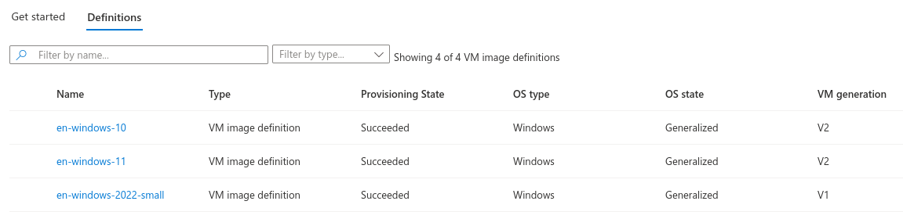
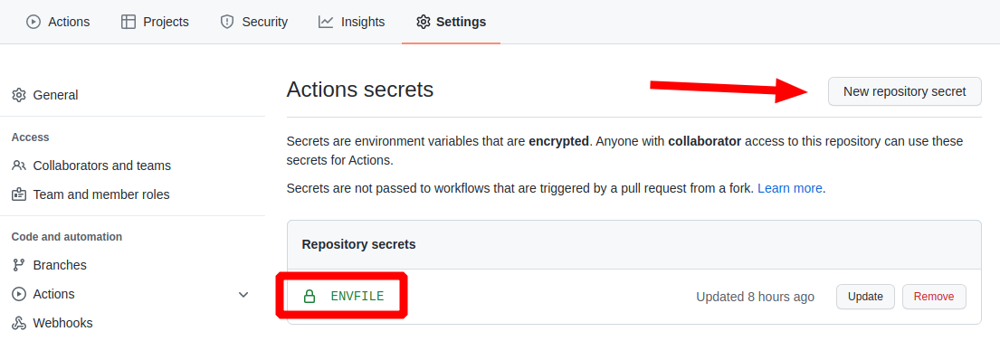
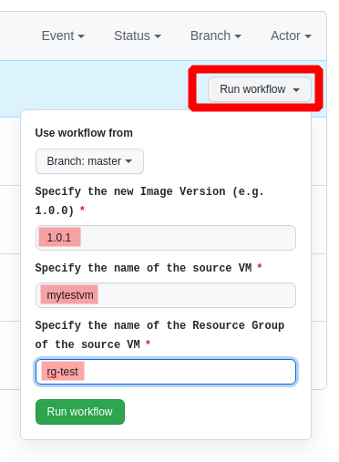

# azure-vm-to-sig

This repo is for creating a **new image version** in **Azure image gallery** from an **existing virtual machine**.

The configured **[workflow in Github Actions](./.github/workflows/generate_new_image_version.yml)** or the **[build.sh](./build.sh)** (if you run it locally) does the following tasks:

1. Deallocates the **existing VM**
2. Creates a copy of the **managed disk** of the existing VM
3. Creates a **new temporary VM** using the copy of the managed disk
4. Logon to the temporary VM and runs **sysprep**
5. Deallocates the temporary VM
6. Creates a **temporary managed Azure Image** from the temporary VM
7. Creates a **new Azure images version** in **Azure Shared Image Gallery**
8. Deletes the **temporary managed Azure Image**
9. Deletes the **temporary VM**

Various variables can be defined in [env.sample](./env.sample)   
Target azure image gallery for example is defined in  `azure_sig_name`   
Target azure image definition is defined in `azure_sig_image_definition_name`

## Pre-requisites

1. You need an **exisiting VM** in Azure. It can be still running or can be deallocated.
2. The existing VM needs to have the windows feature `OpenSSH Server` enabled.  
[More information on enabling **OpenSSH Server** in Windows](https://docs.microsoft.com/en-us/windows-server/administration/openssh/openssh_install_firstuse)  
3. You need an existing **Azure shared image gallery**
4. The Azure image gallery contains already a **VM image definition**, which matches your VM's generation (V1 or V2).



## How to use this repo

### Step 1: Fork the repo

### Step 2: Copy [env.sample](./env.sample) to `.env` using:

The `.env` is in the [.gitignore](./.gitignore) list. This ensure that the file never leaves your local drive when you `git push`.

```bash
cp env.sample .env
```

### Step 3: Adjust variables in `.env`

Please read the comments in `.env`. The should be self explanatory.

### Step 4: Copy the content of `.env` into a Github Action secret named `envfile`

Create a new **repository secret** in Github under **Settings** > **Secrets** named `envfile` and copy&paste the complete content of your `.env` file.



### Step 5: Goto Github Actions and run the workflow

1. Goto **Actions**
2. Choose the workflow `generate_new_image_version`
3. Run the Workflow `generate_new_image_version`

Choose **Run Workflow** and enter corresponding values.



### Wait for the workflow to finish and check results

Wait for the workflow to finish and **check results**.
